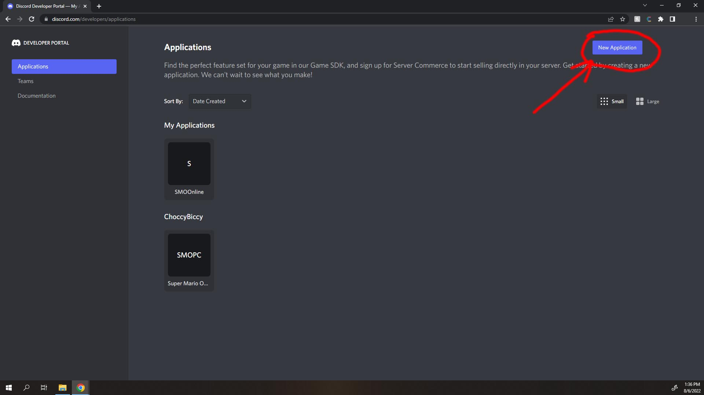
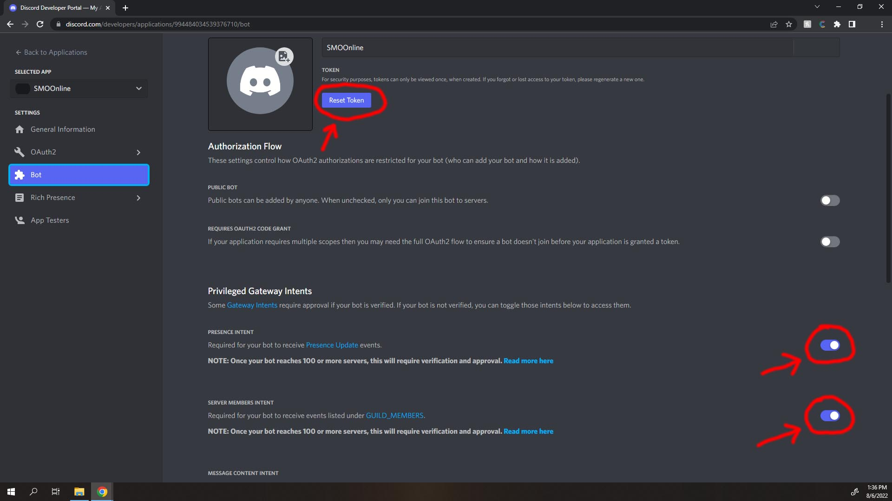
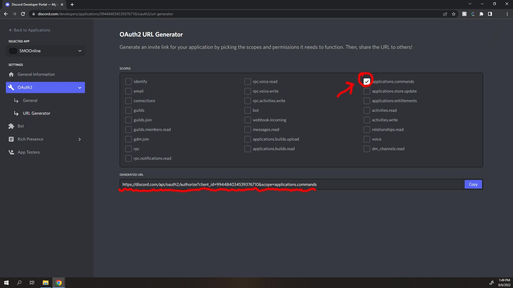

# smoo-bot-extensions

### Setup
Go to https://discord.com/developers, set up 2FA for your discord account (if not already done so), and then make a app. 

After creating an app, click on "Bot" on the left pane, and create a bot. Enable "Presence Intent" and
"Server Members Intent". Then, Create *or* "Reset" the bot token and put the token in config/token.json. Keep in mind, after the token 
is displayed, it will not be displayed again. If you lose it, you'll have to "reset" to make a new one

If you don't have a "token.json" file, 
create one with these contents (token is "for deployment", testtoken is for "testing"):
```
{
    "token": "tokenhere"
    "testtoken": "tokenhere"
}
```
Copy your discord server's ID (right click on the server -> copy ID; make sure you have developer mode enabled in the discord settings)
then open your config/config.json and change `mainguild` to your server's ID (With quotes around it).
After this, go to OAuth2 -> URL Generator in the discord developer application's left pane, check "applications.commands", navigate to the 
generated URL, and approve for the server you'll be using (same server that you set `mainguild` in the json for).

Open a console window, cd to the root directory of the local repo,
and run `npm i .` Wait for all dependences to download, then you can run the bot with `node .` in the root directory.  
Debugging the bot: enter your the testing bot's (you can just use the same bot) token into `testtoken`, change the debug flag to true in config.json,
and set the `developerguild` to your testing server ID (you can just use the same server if you want).

### Commands
`/spinwheel seeker \<players...\>`: "players...": the list of players to choose from.   
`/spinwheel kingdom banned`: "banned": whether or not to include "banned" kindgoms in the spin, e.g. cloud, deep woods, dark side, darker side.   

[//]: # "     <- how to put an image in md"
